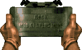
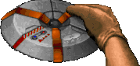
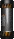

# UZ's Weapons Pack
_Creative, I know_

## Black Hole Generator

- Loadout Code: `bhg`
- Hold `[FIRE]` to charge up & fire.
- Press `[RELOAD]` to reload batteries.
- Press `[UNLOAD]` to unload batteries.
- **!CAUTION!** Black Holes fired known to be unstable!

## Claymore Mines

- Loadout Code: `cly`
- Similar to Doorbusters in that they're an inventory item you `[USE]` to place on the ground at the spot you're looking at, facing away from you.  If a hostile walks within the cone, it'll detonate.
- Press `[USE]` near claymore to pick up & deactivate it.
- Can be shot in a pinch.

## Land Mines

- Loadout Code: `min`
- Hold `[FIRE]` to activate & toss.
- Press `[RELOAD]` to deactivate and cancel toss.
- Press `[USE]` near active land mine to **attempt** to kick away.
- Press `[USE]` **while crouching** near active land mine to pick up & deactivate land mine.
- Can be shot in a pinch.  Careful, may get cought in the cross-fire!

## Pipe Bombs

- Pipe Bomb Loadout Code: `pbg`
- Detonator Loadout Code: `pbd`
- Hold `[FIRE]` to activate & toss.
- Press `[RELOAD]` to deactivate and cancel toss.
- Press `[ALTFIRE]` to detonate all active pipe bombs. **Requires Detonator** 
- Press `[USE]` near active pipe bomb to kick away.
- Press `[USE]` while crouching to pick up & deactivate pipe bomb.
- Can be shot in a pinch.  Careful, may get caught in the cross-fire!

## Credits

### Black Hole Generator

- Sounds: Raven Software (Quake 4), Epic Games (UT 2004)
  - BH_LOOP: NASA
- Sprites: NMN, Zero Prophet, Reactor, Kronos, Midway
- Sprite Edit: Gothic

### Claymore Mines
- Code: Captain Toenail
- GLDefs: GZDoom (lights.pk3)
- Sounds: 3D Realms, insanity54
- Sprites: Id Software, TNTTeam
- Sprite Edit: Captain Toenail
- Idea Base: Call of Duty and NAM

- c4armed.ogg by insanity54
	- https://freesound.org/people/insanity54/sounds/349662/

### Land Mines
- Code: Gothic
- GLDefs: Gothic
- Sounds: LucasArts (Dark Forces), id Software (Quake 2)
- Sprites: LucasArts (Dark Forces), Gothic
- Sprite Edit: Gothic
- Idea Base: Land Mines from Stronghold

### Pipe Bombs
- Sounds: 3D Realms, Eurocom (Duke Nukem 64), Sunstorm Interactive (DN Manhattan Project)
- Sprites: 3D Realms, Scuba Steve, Gothic